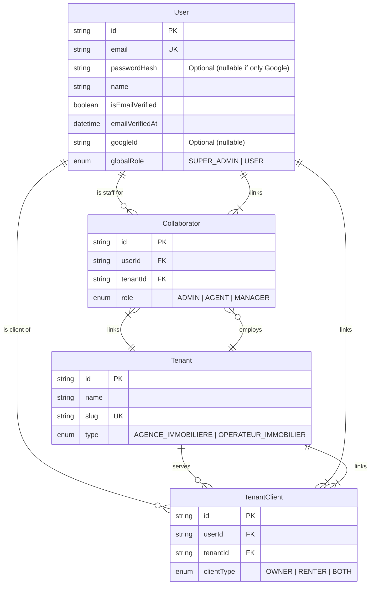

# Data Model: Auth Profiles

**Feature**: `002-auth-profiles`

## Entity Relationship Diagram (Mermaid)



## Schema Definitions (Prisma)

```prisma
enum GlobalRole {
  SUPER_ADMIN
  USER
}

enum TenantType {
  AGENCE_IMMOBILIERE
  OPERATEUR_IMMOBILIER
}

enum CollaboratorRole {
  ADMIN
  AGENT
  MANAGER
}

enum TenantClientType {
  OWNER
  RENTER
  BOTH
}

model User {
  id              String    @id @default(uuid())
  email           String    @unique
  name            String
  passwordHash    String?   // Nullable for OAuth-only users initially
  googleId        String?   @unique
  isEmailVerified Boolean   @default(false)
  emailVerifiedAt DateTime?
  globalRole      GlobalRole @default(USER)

  collaborations  Collaborator[]
  clientProfiles  TenantClient[]

  createdAt       DateTime  @default(now())
  updatedAt       DateTime  @updatedAt
}

model Tenant {
  id              String    @id @default(uuid())
  name            String
  slug            String    @unique // For URL routing: /app/:slug
  type            TenantType

  collaborators   Collaborator[]
  clients         TenantClient[]

  createdAt       DateTime  @default(now())
  updatedAt       DateTime  @updatedAt
}

model Collaborator {
  id        String           @id @default(uuid())
  userId    String
  tenantId  String
  role      CollaboratorRole

  user      User    @relation(fields: [userId], references: [id])
  tenant    Tenant  @relation(fields: [tenantId], references: [id])

  @@unique([userId, tenantId]) // A user has only one collaborator role per tenant
}

model TenantClient {
  id         String           @id @default(uuid())
  userId     String
  tenantId   String
  clientType TenantClientType

  user       User    @relation(fields: [userId], references: [id])
  tenant     Tenant  @relation(fields: [tenantId], references: [id])

  @@unique([userId, tenantId]) // A user has only one client profile per tenant
}
```

## Migration strategy

1. **New Tables**: Create `User`, `Tenant`, `Collaborator`, `TenantClient` (if replacing existing, rename old tables to `*_legacy` first or map accordingly).
2. **Data Transformation**:
   - If migrating from old `users` table, map `email` -> `email`.
   - Create default `Tenant` for existing data if it wasn't multi-tenant before.
   - Link old users to that default Tenant as `Collaborator` or `TenantClient` based on old roles.
```
